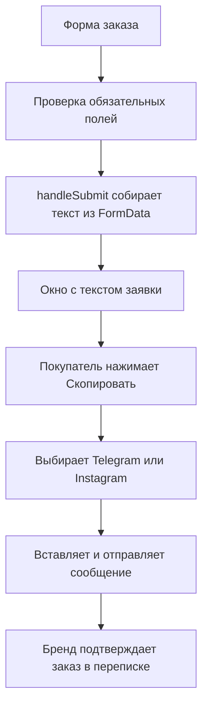

# Карта проекта POSTMIRROR

Актуально на 23 сентября 2026 года. Обновляйте эту карту при изменении структуры, контактов, цен или сценария заказа.

## Назначение

Одна страница с формой заказа поверх полноэкранного фото зеркала без текста. Покупатель заполняет данные, видит предварительную стоимость и нажимает «Оформить заказ». Открывается компактное окно с текстом заявки, отдельной кнопкой копирования и кнопками Telegram / Instagram. Можно отправить текст или скриншот. Покупатель отправляет сообщение самостоятельно, а бренд подтверждает заказ в переписке.

## Где Что Менять

| Задача | Файл / ориентир |
| --- | --- |
| Поля формы и обязательность заполнения | `app/page.tsx`, форма в `Home` |
| Размеры и цены зеркал | `app/page.tsx`, массив `sizes` |
| Виды и стоимость доставки | `app/page.tsx`, массив `deliveries` |
| Расчёт стоимости | `app/page.tsx`, `selectedSize`, `selectedDelivery`, `totalPrice` |
| Текст готового заказа | `app/page.tsx`, функция `handleSubmit` |
| Поля точного адреса и их зависимости | `app/page.tsx`, состояния `region` — `house`; `components/address-combobox.tsx` |
| Запрос адресных подсказок DaData / ФИАС | `app/api/address-suggestions/route.ts` |
| Кнопка копирования и её состояния | `app/page.tsx`, `copyOrder`, `copyState` |
| Ссылки на соцсети | `app/page.tsx`, `telegramUrl`, `instagramUrl` |
| Внешний вид кнопок соцсетей | `SocialLinks` в `app/page.tsx`; `.social-button` в `app/globals.css` |
| Окно после оформления | `app/page.tsx`, блок `Dialog` |
| Крупная инструкция об отправке | `app/page.tsx`, блок `send-instructions` |
| Цвета, размеры, отступы, мобильная версия | `app/globals.css` |
| Название вкладки, описание, шрифт, превью ссылки | `app/layout.tsx` |
| Фото и другие общедоступные файлы | `public/` |
| Настройки размещения | `.openai/hosting.json` и средства Sites |

## Структура

```text
app/
  page.tsx          Единственная страница, форма и окно заказа
  globals.css       Монохромная тема, адаптивность и стили компонентов
  layout.tsx        Общая оболочка, русский язык, Manrope, метаданные
  api/address-suggestions/route.ts Серверный посредник для DaData; скрывает ключ
components/
  address-combobox.tsx Асинхронное поле выбора части адреса
components/ui/
  button.tsx        Кнопки на основе Base UI
  dialog.tsx        Доступное модальное окно, фокус и закрытие
  input.tsx         Однострочные поля
  label.tsx         Подписи полей
  native-select.tsx Выбор размера и доставки
  textarea.tsx      Пожелания и текст заявки
  ...              Остальные компоненты стартового набора
lib/utils.ts        Объединение CSS-классов через cn()
hooks/use-mobile.ts Хук стартового набора; текущая страница не использует
public/
  postmirror-background.png Текущий полноэкранный фон без текста
  postmirror-example-1.png  Референс из чата, на странице больше не используется
  postmirror-example-2.png  Референс из чата, на странице больше не используется
  gallery-1.png             Изображение предыдущей концепции, не используется
  gallery-2.png             Изображение предыдущей концепции, не используется
  og.png                    Превью старого MIRORA, не используется
  favicon.svg               Значок стартового набора
.openai/hosting.json        Привязка к существующему сайту Sites
vite.config.ts             Vinext, Tailwind, Sites и Cloudflare Workers
next.config.ts             Конфигурация совместимого API Next.js
package.json               Команды и зависимости
package-lock.json          Зафиксированные версии зависимостей
tsconfig.json              Настройки TypeScript
README.md                  Краткий вход в проект
PROJECT_MAP.md             Эта карта
```

Папки `node_modules/`, `dist/`, `.vinext/`, `.wrangler/` генерируются инструментами. Их не редактируют вручную. Архив `mirora-site.tar.gz` служит для размещения сайта, не является исходным кодом и не должен попадать в коммиты.

## Сценарий И Данные



- Размер и доставка хранятся в состоянии React и пересчитывают стоимость сразу при выборе. У варианта «Свой размер» цена `null`: итог не считается, показывается «Цена уточняется в чате». Не заменять неизвестную стоимость нулём.
- Текстовые поля читаются через `FormData` в момент нажатия кнопки. Пробелы по краям убираются.
- Обязательные поля: ник/пост для зеркала, ФИО и телефон. Поля Telegram и Instagram клиента удалены: покупатель отправляет готовую заявку со своего аккаунта, поэтому отдельный ник для связи не запрашивается. Поле `instagramTag` относится только к посту, который нужно воплотить в зеркале. Адрес показывается только для курьера по СПб и доставки по России; при самовывозе весь блок скрыт, отключён и в заявку не попадает. Для «Свой размер» появляется обязательное поле `customSize` с желаемыми габаритами, которые включаются в текст заявки. Комментарий необязателен, его подсказка содержит конкретный пример надписи и даты.
- Адрес выбирается строго от большего к меньшему: область / край / республика → город или район → посёлок / село / деревня при необходимости → улица → дом → квартира и уточнения при необходимости. Первые два уровня, улица и дом обязательны. `handleSubmit` объединяет выбранные части через запятую в одну строку «Адрес:» и исключает её при самовывозе.
- Поля `region`, `locality`, `settlement`, `street` и `house` получают подсказки DaData на основе ФИАС. Выбрать следующий уровень можно только после предыдущего; его ФИАС-идентификаторы ограничивают поиск. Если изменить верхний уровень, все зависимые значения очищаются, поэтому несовместимые части адреса не попадут в заказ.
- Браузер обращается только к `/api/address-suggestions`. Серверный обработчик добавляет ключ DaData и возвращает сокращённые данные без раскрытия ключа. `DADATA_API_KEY` хранится в защищённой переменной окружения Sites и никогда не должен попадать в исходники, карту проекта, журнал браузера или клиентский код.
- Для подбора вариантов введённые фрагменты адреса передаются DaData. Об этом есть короткое уведомление под адресным блоком. ФИО, телефон, ссылка на пост, квартира и комментарий сервису подсказок не отправляются.
- Поля имеют ограничения длины. Обязательные однострочные поля не принимают строку только из пробелов. Полноценная проверка существования аккаунта или номера телефона не выполняется.
- Окно показывает снимок данных на момент оформления. После возврата к форме и повторного оформления текст собирается заново. В сообщении остаётся одна ценовая строка «Итоговая стоимость»: сумма или «цена уточняется в чате», без отдельных строк с ценой зеркала и доставки. Способ доставки сохраняется среди параметров заказа. Пустые адрес и комментарий не добавляются, приветствие и заключительная просьба убраны для компактности.
- Сообщение отображается полностью в выделяемом `pre` (`messageRef`), с переносами длинных строк. У него нет отдельной внутренней прокрутки. При длинных данных прокручивается окно целиком; один скриншот гарантировать для произвольного текста нельзя.
- `copyState`: `idle`, `copying`, `copied`, `error`. Успешное сообщение появляется только после завершения копирования.
- Если браузер запрещает копирование, текст выделяется и появляется инструкция для ручного копирования.
- Закрытие окна сохраняет форму и возвращает фокус к кнопке оформления. Перезагрузка страницы очищает данные.
- Серверного приёма заказов, базы данных, Telegram-бота, оплаты, localStorage и автоматической отправки сообщений нет. Данные заказа остаются на странице до копирования/отправки самим покупателем; исключение — поисковые фрагменты адреса, которые передаются DaData только для показа подсказок.
- Ссылки на соцсети не содержат данные заказа, открываются отдельно и используют `noopener noreferrer`.

## Контакты И Оформление

- Telegram: https://t.me/post_miror_zakaz (именно `miror`, как указано владельцем).
- Instagram: https://www.instagram.com/post_mirror (в коде сохранена полная ссылка владельца с параметрами).
- Название на странице: POSTMIRROR.
- Исходный референс: https://chatgpt.com/share/6aa1a273-3bd8-83ed-9c35-7b4b0b5459e1.
- Текущий фон создан встроенным ImageGen по первому референсу и сохранён в `public/postmirror-background.png`. Краткое задание: «Широкое реалистичное фото тёмного интерьера, прямоугольное зеркало на мраморной подставке слева, спокойная тёмная область справа под форму; убрать все надписи и логотипы, сохранить прямые углы и отсутствие боковой рамки». Это визуализация продукта, не фотография готового изделия.
- `photo-backdrop` в `page.tsx` и CSS задают фиксированный полноэкранный фон; старые галереи и рекламный заголовок удалены. Изображение также используется в превью ссылки. Файлы локальные, временные ссылки из чата не используются.
- На компьютере форма находится справа, зеркало видно слева. При ширине до 760 px форма занимает доступную ширину с небольшим открытым участком фонового фото сверху. При ширине до 600 px кнопки соцсетей перестраиваются в один столбец.
- Компактное окно заказа рассчитано на скриншот типичного заказа; кнопки соцсетей стоят в два столбца с названиями без длинных ников. Большие объёмы текста прокручиваются. Анимация появления учитывает системное уменьшение движения.

## Размеры И Цены

Владелец подтвердил 09.09.2026 два варианта ниже. Остальные размеры из первой версии удалены из выбора.

| Размер | Цена зеркала |
| --- | --- |
| 50 × 70 см | 5 000 ₽ |
| Свой размер | Цена уточняется в чате |

Доставка: самовывоз 0 ₽, курьер по СПб 900 ₽, по России 1 490 ₽. Место самовывоза и сами тарифы ещё требуют подтверждения владельца. Для стандартного размера итог равен 5 000 ₽ плюс доставка; для своего размера и стоимость зеркала, и итог уточняются в чате.

## Проверка Изменений

```sh
npx tsc --noEmit
npx oxlint app/page.tsx app/layout.tsx app/api/address-suggestions/route.ts components/address-combobox.tsx
npm run build
npm run start
```

Сборка и TypeScript прошли после последней переделки. Локальная собранная страница работает. Проведена браузерная проверка на ширинах 1440, 390 и 360 px: форма, новый фотофон, открытие заказа и успешное копирование. После дальнейших изменений полей браузерная проверка не повторялась. Реальные iOS/Android-устройства не тестировались.

Общий `npm run lint` пока выдаёт замечания в не изменённых компонентах стартового набора: `pagination`, `breadcrumb`, `spinner`, `input-group`, `input-otp`, `carousel`, `button-group`, `label`, `item`, `field`, `chart` и `hooks/use-mobile.ts`. Не путать это с проверкой изменённой страницы.

При проверке сценария вручную: пустая форма не открывает окно; смена размера/доставки меняет сумму; при самовывозе весь адрес скрыт и отсутствует в заявке; для курьера по СПб и доставки по России область, город/район, улица и дом выбираются из подсказок и обязательны; посёлок и квартира необязательны; смена области очищает все уровни ниже; части адреса объединяются в одну строку заявки от большего к меньшему; копирование работает или даёт понятную инструкцию; закрытие/повторное оформление сохраняет актуальные данные; кнопки ведут на нужные аккаунты. Тестовые сообщения владельцу отправлять не нужно.

## Размещение

- Текущий адрес: https://mirora-studio.stefanovskiy.chatgpt.site. Адрес сохранился от первой концепции MIRORA.
- Проект Sites: `appgprj_6a94037fd4148191acbd89d217579f1b`. Использовать существующий проект, не создавать новый при обычных правках.
- При проверке 09.09.2026 доступ был только у владельца. Публичный доступ для покупателей отдельно не включён.
- Рабочая ветка исходников: `main`. Секреты и временные токены не хранить в файлах или Git.
- Производственная переменная `DADATA_API_KEY` добавлена в Sites как секрет. При смене ключа обновлять значение через настройки окружения Sites, а не через файлы проекта.
- Перед размещением: проверить изменения, успешно собрать сайт, закоммитить нужные исходники и отправить их в привязанный репозиторий. Не добавлять случайные архивы или чужие изменения.
- Архив собирается штатным `scripts/package-site.mjs` плагина Sites из готовой сборки; затем версия сохраняется и размещается с проверкой итогового статуса.
- При работе в Codex следовать актуальным навыкам `sites-building` и `sites-hosting`. Версия 0.1.66 использует Node-скрипты. Если `build-site.mjs` на Windows не находит npm, рабочая команда проекта `npm run build` выполняет ту же сборку.
- Если `npm run dev` сообщает о старом сервере, сначала проверить процесс и адрес. Не завершать посторонние процессы вслепую. Для собранной версии можно использовать `npm run start`.

## Правило Для Будущих Правок

После изменения функции заказа обновляйте раздел «Сценарий и данные». После изменения полей, цен, фотографий или контактов обновляйте соответствующие разделы этой карты. После изменения доступа или адреса обновляйте раздел «Размещение». Так карта остаётся полезной точкой входа, а не описанием устаревшей версии.
